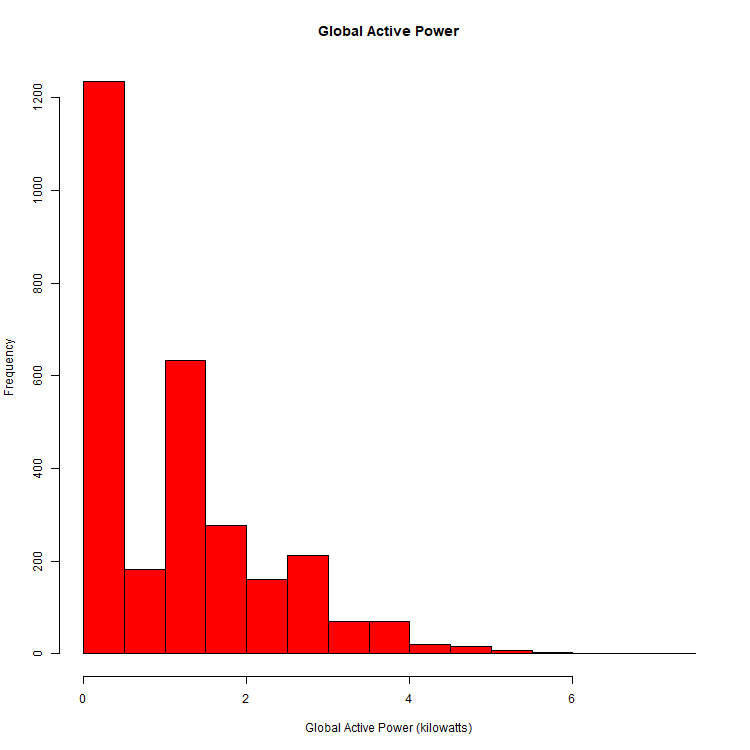
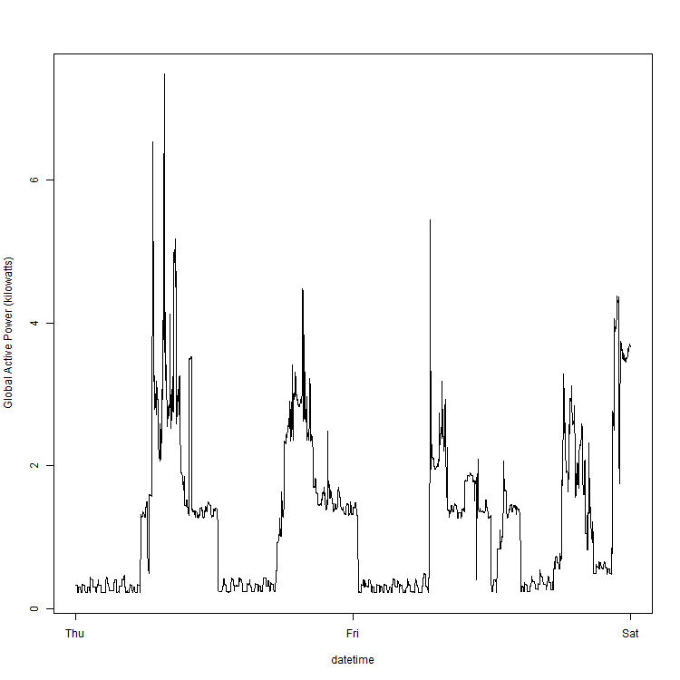
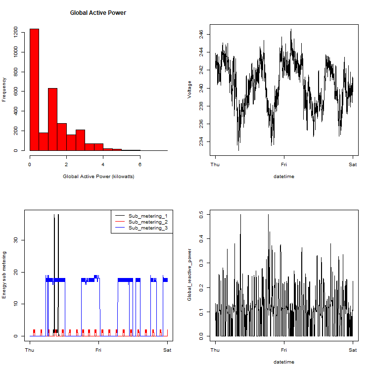

# C4W1A1

This assignment uses data from the UC Irvine Machine Learning Repository, a popular repository for machine learning datasets. In particular, we will be using the “Individual household electric power consumption Data Set” which I have made available on the course web site:

    - Dataset: Electric power consumption [20Mb]

        Classes ‘data.table’ and 'data.frame':  2075259 obs. of  9 variables:
        - Date                 : chr  "16/12/2006" "16/12/2006" "16/12/2006" "16/12/2006" ...
        - Time                 : chr  "17:24:00" "17:25:00" "17:26:00" "17:27:00" ...
        - Global_active_power  : num  4.22 5.36 5.37 5.39 3.67 ...
        - Global_reactive_power: num  0.418 0.436 0.498 0.502 0.528 0.522 0.52 0.52 0.51 0.51 ...
        - Voltage              : num  235 234 233 234 236 ...
        - Global_intensity     : num  18.4 23 23 23 15.8 15 15.8 15.8 15.8 15.8 ...
        - Sub_metering_1       : num  0 0 0 0 0 0 0 0 0 0 ...
        - Sub_metering_2       : num  1 1 2 1 1 2 1 1 1 2 ...
        - Sub_metering_3       : num  17 16 17 17 17 17 17 17 17 16 ...
        - attr(*, ".internal.selfref")=<externalptr>

    - Description: Measurements of electric power consumption in one household with a one-minute sampling rate over a period of almost 4 years. Different electrical quantities and some sub-metering values are available.

The following descriptions of the 9 variables in the dataset are taken from the UCI web site:

    - Date: Date in format dd/mm/yyyy
    - Time: time in format hh:mm:ss
    - Global_active_power: household global minute-averaged active power (in kilowatt)
    - Global_reactive_power: household global minute-averaged reactive power (in kilowatt)
    - Voltage: minute-averaged voltage (in volt)
    - Global_intensity: household global minute-averaged current intensity (in ampere)
    - Sub_metering_1: energy sub-metering No. 1 (in watt-hour of active energy). It corresponds to the kitchen, containing mainly a dishwasher, an oven and a microwave (hot plates are not electric but gas powered).
    - Sub_metering_2: energy sub-metering No. 2 (in watt-hour of active energy). It corresponds to the laundry room, containing a washing-machine, a tumble-drier, a refrigerator and a light.
    - Sub_metering_3: energy sub-metering No. 3 (in watt-hour of active energy). It corresponds to an electric water-heater and an air-conditioner.

## Criteria:

    - Was a valid GitHub URL containing a git repository submitted?
    - Does the GitHub repository contain at least one commit beyond the original fork?
    - Please examine the plot files in the GitHub repository. Do the plot files appear to be of the correct graphics file format?
    - Does each plot appear correct?
    - Does each set of R code appear to create the reference plot?

## Output

