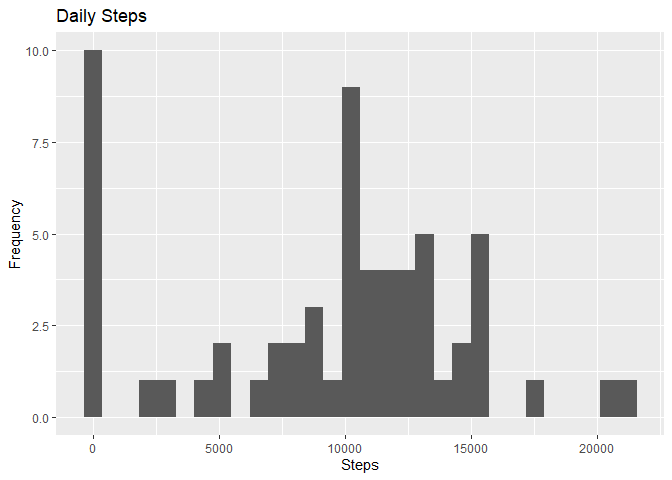
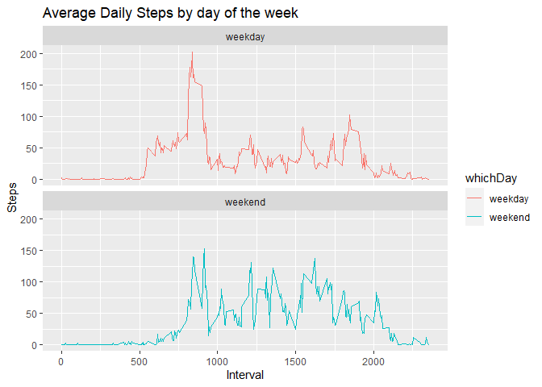

## Introduction

It is now possible to collect a large amount of data about personal movement using activity monitoring devices such as a Fitbit, Nike Fuelband, or Jawbone Up. These type of devices are part of the “quantified self” movement – a group of enthusiasts who take measurements about themselves regularly to improve their health, to find patterns in their behavior, or because they are tech geeks. But these data remain under-utilized both because the raw data are hard to obtain and there is a lack of statistical methods and software for processing and interpreting the data.

This assignment makes use of data from a personal activity monitoring device. This device collects data at 5 minute intervals through out the day. The data consists of two months of data from an anonymous individual collected during the months of October and November, 2012 and include the number of steps taken in 5 minute intervals each day.

# Assignment Implementation  

## Loading and preprocessing the data


```r
library(data.table)
library(ggplot2)

unzip("repdata.data.activity.zip")
```

```
## Warning in unzip("repdata.data.activity.zip"): error 1 in extracting from zip
## file
```

```r
# READING CSV
act.dt = data.table::fread(input = "activity.csv")
print(str(act.dt))
```

```
## Classes 'data.table' and 'data.frame':	17568 obs. of  3 variables:
##  $ steps   : int  NA NA NA NA NA NA NA NA NA NA ...
##  $ date    : IDate, format: "2012-10-01" "2012-10-01" ...
##  $ interval: int  0 5 10 15 20 25 30 35 40 45 ...
##  - attr(*, ".internal.selfref")=<externalptr> 
## NULL
```


## Histogram of the total number of steps taken each day


```r
# Compute total steps using lapply
total.steps = act.dt[, c(lapply(.SD, sum, na.rm = FALSE)), .SDcols = c("steps"), by = .(date)] 

# Hist plot
ggplot(total.steps, aes(x = steps)) +
    geom_histogram(bins = 25) +
    labs(title = "Histogram of the total number of steps taken each day", 
         x = "Steps", y = "Frequency")
```

```
## Warning: Removed 8 rows containing non-finite values (stat_bin).
```

<!-- -->

## Mean and median of the total number of steps taken per day  


```r
# COMPUTE MEAN AND MEDIAN
total.steps[, .(Mean.Steps = mean(steps, na.rm = TRUE),
                Median.Steps = median(steps, na.rm = TRUE))]
```

```
##    Mean.Steps Median.Steps
## 1:   10766.19        10765
```

## What is the average daily activity pattern?

1. Make a time series plot of the 5-minute interval (x-axis) and the average number of steps taken, averaged across all days (y-axis)


```r
# Compute mean steps taken within 5 mins interval
interval.5m.dt = act.dt[, c(lapply(.SD, mean, na.rm = TRUE)),
                    .SDcols = c("steps"), by = .(interval)]

# TS plot
ggplot(interval.5m.dt, aes(x = interval , y = steps)) + 
    geom_line() + 
    labs(title = "Average Daily Steps", 
         x = "Interval", y = "Average Daily Steps")
```

<!-- -->

2. Which 5-minute interval, on average across all the days in the dataset, contains the maximum number of steps?


```r
interval.5m.dt[steps == max(steps), .(max.interval = interval)]
```

```
##    max.interval
## 1:          835
```


## Imputing missing values

1. Calculate and report the total number of missing values in the dataset (i.e. the total number of rows with 𝙽𝙰s)


```r
# Number of null
nrow(act.dt[is.na(steps),])
```

```
## [1] 2304
```

2. Devise a strategy for filling in all of the missing values in the dataset. The strategy does not need to be sophisticated. For example, you could use the mean/median for that day, or the mean for that 5-minute interval, etc.


```r
# Fillna with median
act.dt[is.na(steps), "steps"] = act.dt[, c(lapply(.SD, median, na.rm = TRUE)),
                                       .SDcols = c("steps")]
```

3. Create a new dataset that is equal to the original dataset but with the missing data filled in.


```r
data.table::fwrite(x = act.dt, file = "cleanedData.csv", quote = FALSE)
```

4. Make a histogram of the total number of steps taken each day and calculate and report the mean and median total number of steps taken per day. Do these values differ from the estimates from the first part of the assignment? What is the impact of imputing missing data on the estimates of the total daily number of steps?


```r
# total number of steps taken per day
total.steps = act.dt[, c(lapply(.SD, sum)),
                     .SDcols = c("steps"), by = .(date)]

# mean and median total number of steps taken per day
total.steps[, .(Mean.Steps = mean(steps),
                Median.Steps = median(steps))]
```

```
##    Mean.Steps Median.Steps
## 1:    9354.23        10395
```

```r
ggplot(total.steps, aes(x = steps)) + 
    geom_histogram(bins=30) + 
    labs(title = "Daily Steps", x = "Steps", y = "Frequency")
```

<!-- -->

Type of Estimate | Mean.Steps | Median.Steps
--- | --- | ---
With NA:

    - Mean steps: 10765
    - Median steps: 10765

Fillna with median:

    - Mean steps: 9354.23
    - Median steps: 10395

## Are there differences in activity patterns between weekdays and weekends?

1. Create a new factor variable in the dataset with two levels – “weekday” and “weekend” indicating whether a given date is a weekday or weekend day.


```r
# Casting datetime obj
act.dt[, date := as.POSIXct(date, format = "%Y-%m-%d")]
# mapping day in a week
act.dt[, `DOW`:= weekdays(x = date)]
# search for Mon-Fri then assign as weekday
act.dt[grepl(pattern = "Monday|Tuesday|Wednesday|Thursday|Friday",
             x = `DOW`), "whichDay"] = "weekday"
# search for Sat-Sun then assign as weekedn
act.dt[grepl(pattern = "Saturday|Sunday",
             x = `DOW`),"whichDay"] = "weekend"
# factorize
act.dt[, `whichDay` := as.factor(`whichDay`)]
```

2. Make a panel plot containing a time series plot (i.e. 𝚝𝚢𝚙𝚎 = "𝚕") of the 5-minute interval (x-axis) and the average number of steps taken, averaged across all weekday days or weekend days (y-axis). See the README file in the GitHub repository to see an example of what this plot should look like using simulated data.


```r
interval.5m.dt = act.dt[, c(lapply(.SD, mean, na.rm = TRUE)),
                        .SDcols = c("steps"), by = .(interval, `whichDay`)]

ggplot(interval.5m.dt , aes(x = interval , y = steps, color=`whichDay`)) +
    geom_line() + 
    labs(title = "Average Daily Steps by day of the week",
         x = "Interval", y = "Steps") +
    facet_wrap(~`whichDay` , ncol = 1, nrow=2)
```

<!-- -->


