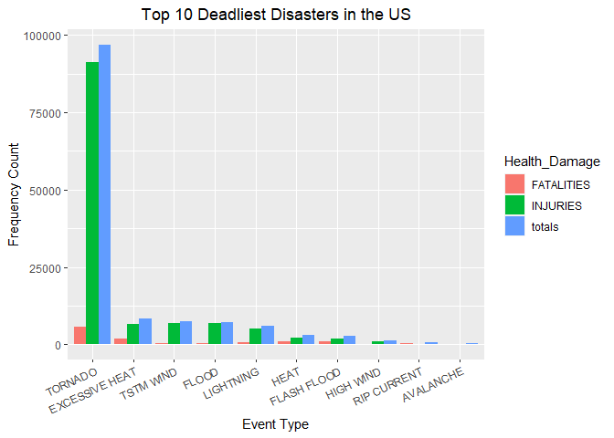
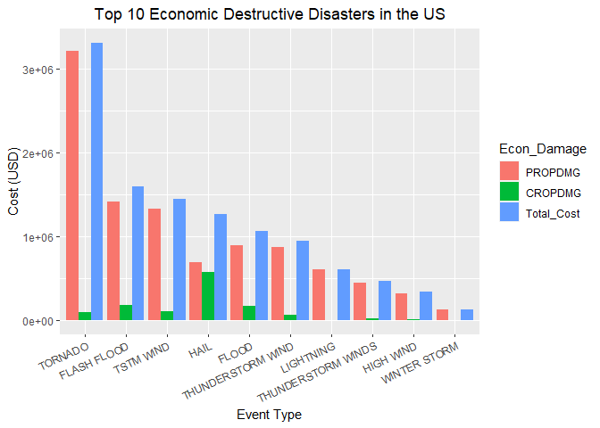

# Introduction

Storms and other severe weather events can cause both public health and economic problems for communities and municipalities. Many severe events can result in fatalities, injuries, and property damage, and preventing such outcomes to the extent possible is a key concern.

This project involves exploring the U.S. National Oceanic and Atmospheric Administration's (NOAA) storm database. This database tracks characteristics of major storms and weather events in the United States, including when and where they occur, as well as estimates of any fatalities, injuries, and property damage.

# Data

The data for this assignment come in the form of a comma-separated-value file compressed via the bzip2 algorithm to reduce its size. You can download the file from the course web site:

    - Storm Data [47Mb]


There is also some documentation of the database available. Here you will find how some of the variables are constructed/defined.

    - National Weather Service Storm Data Documentation
    
    - National Climatic Data Center Storm Events FAQ
    
The events in the database start in the year 1950 and end in November 2011. In the earlier years of the database there are generally fewer events recorded, most likely due to a lack of good records. More recent years should be considered more complete.


# Synopsis:

The basic goal of this assignment is to explore the NOAA Storm Database and answer some basic questions about severe weather events. You must use the database to answer the questions below and show the code for your entire analysis. Your analysis can consist of tables, figures, or other summaries. You may use any R package you want to support your analysis.

Questions
Your data analysis must address the following questions:

    1. Across the United States, which types of events are most harmful with respect to population health?
    
    2. Across the United States, which types of events have the greatest economic consequences?
    
Consider writing your report as if it were to be read by a government or municipal manager who might be responsible for preparing for severe weather events and will need to prioritize resources for different types of events. However, there is no need to make any specific recommendations in your report.

# Assignment Implementation

The github link to this project is [here](https://github.com/HieuFromWaterloo/DataScience-JHKS/tree/master/Course5-ReproduceResearch/C5W4A2)

## 2. Data Processing

Read the data from CSV then covert into data.table


```r
library("data.table")
library("ggplot2")

main.csv = read.csv("repdata_data_StormData.csv.bz2")
main.dt = as.data.table(main.csv)
str(main.dt)
```

```
## Classes 'data.table' and 'data.frame':	902297 obs. of  37 variables:
##  $ STATE__   : num  1 1 1 1 1 1 1 1 1 1 ...
##  $ BGN_DATE  : chr  "4/18/1950 0:00:00" "4/18/1950 0:00:00" "2/20/1951 0:00:00" "6/8/1951 0:00:00" ...
##  $ BGN_TIME  : chr  "0130" "0145" "1600" "0900" ...
##  $ TIME_ZONE : chr  "CST" "CST" "CST" "CST" ...
##  $ COUNTY    : num  97 3 57 89 43 77 9 123 125 57 ...
##  $ COUNTYNAME: chr  "MOBILE" "BALDWIN" "FAYETTE" "MADISON" ...
##  $ STATE     : chr  "AL" "AL" "AL" "AL" ...
##  $ EVTYPE    : chr  "TORNADO" "TORNADO" "TORNADO" "TORNADO" ...
##  $ BGN_RANGE : num  0 0 0 0 0 0 0 0 0 0 ...
##  $ BGN_AZI   : chr  "" "" "" "" ...
##  $ BGN_LOCATI: chr  "" "" "" "" ...
##  $ END_DATE  : chr  "" "" "" "" ...
##  $ END_TIME  : chr  "" "" "" "" ...
##  $ COUNTY_END: num  0 0 0 0 0 0 0 0 0 0 ...
##  $ COUNTYENDN: logi  NA NA NA NA NA NA ...
##  $ END_RANGE : num  0 0 0 0 0 0 0 0 0 0 ...
##  $ END_AZI   : chr  "" "" "" "" ...
##  $ END_LOCATI: chr  "" "" "" "" ...
##  $ LENGTH    : num  14 2 0.1 0 0 1.5 1.5 0 3.3 2.3 ...
##  $ WIDTH     : num  100 150 123 100 150 177 33 33 100 100 ...
##  $ F         : int  3 2 2 2 2 2 2 1 3 3 ...
##  $ MAG       : num  0 0 0 0 0 0 0 0 0 0 ...
##  $ FATALITIES: num  0 0 0 0 0 0 0 0 1 0 ...
##  $ INJURIES  : num  15 0 2 2 2 6 1 0 14 0 ...
##  $ PROPDMG   : num  25 2.5 25 2.5 2.5 2.5 2.5 2.5 25 25 ...
##  $ PROPDMGEXP: chr  "K" "K" "K" "K" ...
##  $ CROPDMG   : num  0 0 0 0 0 0 0 0 0 0 ...
##  $ CROPDMGEXP: chr  "" "" "" "" ...
##  $ WFO       : chr  "" "" "" "" ...
##  $ STATEOFFIC: chr  "" "" "" "" ...
##  $ ZONENAMES : chr  "" "" "" "" ...
##  $ LATITUDE  : num  3040 3042 3340 3458 3412 ...
##  $ LONGITUDE : num  8812 8755 8742 8626 8642 ...
##  $ LATITUDE_E: num  3051 0 0 0 0 ...
##  $ LONGITUDE_: num  8806 0 0 0 0 ...
##  $ REMARKS   : chr  "" "" "" "" ...
##  $ REFNUM    : num  1 2 3 4 5 6 7 8 9 10 ...
##  - attr(*, ".internal.selfref")=<externalptr>
```

This data contains 902297 obs. with  37 columns

### 2.1. Data Filtering

Select only columns which we will use for the analysis, namely `"EVTYPE", "FATALITIES","INJURIES", "PROPDMG","CROPDMG"`


```r
# Filter Cols
main.dt = main.dt[, c("EVTYPE", "FATALITIES",
                      "INJURIES", "PROPDMG",
                      "CROPDMG")]

# Only use data where fatalities or injuries > 0 
main.dt = main.dt[(EVTYPE != "?" &
                   (INJURIES > 0 | FATALITIES > 0 | PROPDMG > 0 | CROPDMG > 0)),]
```

After applying filtering, our dataset now contains 245704  obs. of  7 variables as shown below:


```r
str(main.dt)
```

```
## Classes 'data.table' and 'data.frame':	254632 obs. of  5 variables:
##  $ EVTYPE    : chr  "TORNADO" "TORNADO" "TORNADO" "TORNADO" ...
##  $ FATALITIES: num  0 0 0 0 0 0 0 0 1 0 ...
##  $ INJURIES  : num  15 0 2 2 2 6 1 0 14 0 ...
##  $ PROPDMG   : num  25 2.5 25 2.5 2.5 2.5 2.5 2.5 25 25 ...
##  $ CROPDMG   : num  0 0 0 0 0 0 0 0 0 0 ...
##  - attr(*, ".internal.selfref")=<externalptr>
```
There is no null values:


```r
nrow(main.dt[is.na(INJURIES),])
```

```
## [1] 0
```
### 2.2. Compute Total Fatalities and Injuries


```r
total.injury.dt = main.dt[, .(FATALITIES = sum(FATALITIES), INJURIES = sum(INJURIES), totals = sum(FATALITIES) + sum(INJURIES)), by = .(EVTYPE)]
# sort by decreasing order
total.injury.dt = total.injury.dt[order(-FATALITIES), ]
total.injury.dt = total.injury.dt[1:10, ]
head(total.injury.dt, 5)
```

```
##            EVTYPE FATALITIES INJURIES totals
## 1:        TORNADO       5633    91346  96979
## 2: EXCESSIVE HEAT       1903     6525   8428
## 3:    FLASH FLOOD        978     1777   2755
## 4:           HEAT        937     2100   3037
## 5:      LIGHTNING        816     5230   6046
```

### 2.3. Compute Total Property and Crop Cost


```r
total.prop.crop.cost = main.dt[, .(PROPDMG  = sum(PROPDMG), CROPDMG = sum(CROPDMG), Total_Cost = sum(PROPDMG) + sum(CROPDMG)), by = .(EVTYPE)]
# sort by decreasing order
total.prop.crop.cost = total.prop.crop.cost[order(-Total_Cost), ]
total.prop.crop.cost = total.prop.crop.cost[1:10, ]
head(total.prop.crop.cost, 5)
```

```
##         EVTYPE   PROPDMG  CROPDMG Total_Cost
## 1:     TORNADO 3212258.2 100018.5    3312277
## 2: FLASH FLOOD 1420124.6 179200.5    1599325
## 3:   TSTM WIND 1335965.6 109202.6    1445168
## 4:        HAIL  688693.4 579596.3    1268290
## 5:       FLOOD  899938.5 168037.9    1067976
```

## 3: Results

### 3.1. Across the United States, which types of events are most harmful with respect to population health?

Melting data table

```r
health.harmful.dt = melt(total.injury.dt, id.vars="EVTYPE", variable.name = "Health_Damage")
head(health.harmful.dt, 5)
```

```
##            EVTYPE Health_Damage value
## 1:        TORNADO    FATALITIES  5633
## 2: EXCESSIVE HEAT    FATALITIES  1903
## 3:    FLASH FLOOD    FATALITIES   978
## 4:           HEAT    FATALITIES   937
## 5:      LIGHTNING    FATALITIES   816
```

Create chart:


```r
ggplot(health.harmful.dt, aes(x=reorder(EVTYPE, -value), y=value)) +
  # Plot data as bar chart
  geom_bar(stat="identity", aes(fill=Health_Damage), position="dodge") +
  # set y-axis label
  ylab("Frequency Count") +
  # Set x-axis label
  xlab("Event Type") +
  # Rotate x-axis for better labelling
  theme(axis.text.x = element_text(angle=25, hjust=1)) +
  # Set chart title and center it
  ggtitle("Top 10 Deadliest Disasters in the US") +
  theme(plot.title = element_text(hjust = 0.5))
```

<!-- -->

Based on the plot above, we observed that Tornadoe caused the most fatalities and injuries over the years.

### 3.2.Across the United States, which types of events have the greatest economic consequences?

Melting data table 

```r
econ.consequences = melt(total.prop.crop.cost, id.vars="EVTYPE", variable.name = "Econ_Damage")
head(econ.consequences, 5)
```

```
##         EVTYPE Econ_Damage     value
## 1:     TORNADO     PROPDMG 3212258.2
## 2: FLASH FLOOD     PROPDMG 1420124.6
## 3:   TSTM WIND     PROPDMG 1335965.6
## 4:        HAIL     PROPDMG  688693.4
## 5:       FLOOD     PROPDMG  899938.5
```

Create chart:


```r
ggplot(econ.consequences, aes(x=reorder(EVTYPE, -value), y=value)) +
  # Plot data as bar chart
  geom_bar(stat="identity", aes(fill=Econ_Damage), position="dodge") +
  # set y-axis label
  ylab("Cost (USD)") + 
  # Set x-axis label
  xlab("Event Type") +
  # Rotate x-axis tick labels 
  theme(axis.text.x = element_text(angle=25, hjust=1)) +
  # Set title
  ggtitle("Top 10 Economic Destructive Disasters in the US") + 
  theme(plot.title = element_text(hjust = 0.5))
```

<!-- -->

Based on the plot above, we observed that Tornado caused the most economical damage shown by the highest cost in properties and crops.

Overall, Tornado is the deadliest disasters which can cause both heath and economical damages in the US.

